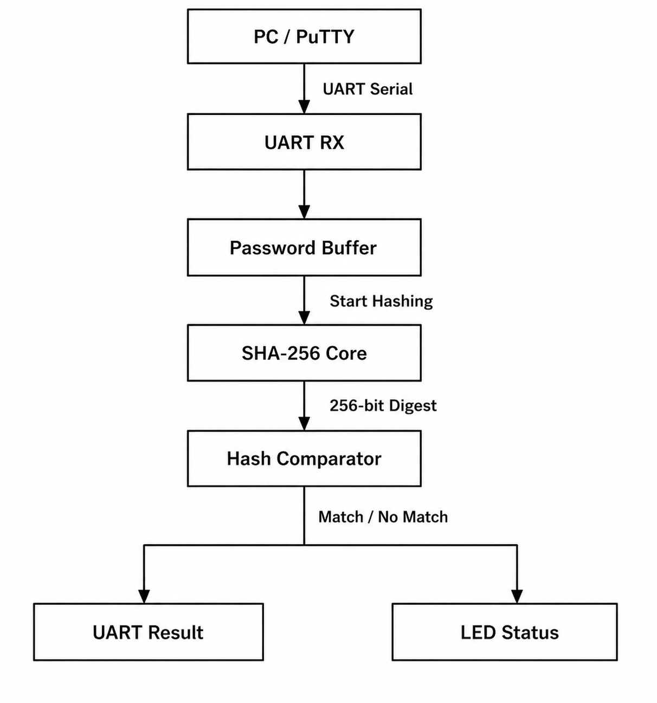

# A Report on FPGA-Based SHA-256 UART Authentication System

**Target Board:** AT-STLN-ARTIX7-001 (XC7A35T)  
**System Clock:** 24 MHz  
**HDL:** Verilog

### **Submitted by:** Bhoomika Paradkar

---

# **Part A — Project Overview**

## **1. What This System Does**

This project implements a secure password authentication system entirely on an FPGA using a hardware implementation of the **SHA-256 cryptographic hash algorithm**.

Instead of storing the original password, the FPGA stores only the **256-bit SHA-256 hash** of the valid password. When a user enters a password through a serial terminal (PuTTY) via UART, the FPGA receives the characters, computes their SHA-256 hash in hardware, and compares the generated hash with the stored reference hash.

The authentication result is displayed through UART messages and the onboard LEDs.

---

## **2. Working Principle**

### **Step 1 – System Initialization**

After power-up or reset:

- UART Receiver is initialized.
- Password Buffer is cleared.
- SHA-256 Core enters the idle state.
- FPGA transmits:

```
Enter Password:
```

to the serial terminal.

---

### **Step 2 – Password Reception**

The user types the password using PuTTY.

Example:

```
password123
```

Each ASCII character is received through UART and stored sequentially inside the Password Buffer.

---

### **Step 3 – Password Buffer**

The Password Buffer:

- Stores all received characters.
- Counts password length.
- Detects the Enter key.
- Generates a single-cycle hashing trigger.

After pressing **Enter**, the password is transferred to the SHA-256 Core.

---

### **Step 4 – SHA-256 Hash Computation**

The SHA-256 hardware module:

- Pads the message.
- Expands message words.
- Executes all 64 compression rounds.
- Produces a 256-bit hash digest.

---

### **Step 5 – Hash Comparison**

The generated digest is compared against the stored golden hash.

If both hashes match:

```
Authentication Successful
```

Otherwise:

```
Authentication Failed
```

is transmitted through UART.

---

### **Step 6 – LED Indication**

Since the FPGA board contains only **8 LEDs**, they indicate the authentication status.

| **LED Pattern** | **Status** |
|:---------------:|------------|
| `11111111` | Access Granted |
| `00000000` | Access Denied |
| `10101010` | SHA-256 Processing |
| `01010101` | Waiting for Password |

---

# **Part B — System Architecture**

<p align="center">
  
</p>

**Figure 1:** Block diagram of the UART-Based SHA-256 Authentication System.

---

# **Part C — RTL Module Description**

| **Module Name** | **Description** |
|-----------------|-----------------|
| `top.v` | Top-level module integrating all RTL modules |
| `uart_rx.v` | UART Receiver for serial communication |
| `uart_tx.v` | UART Transmitter for authentication response |
| `password_buffer.v` | Stores received password characters |
| `padding.v` | Generates SHA-256 message padding |
| `sha256.v` | Top-level SHA-256 wrapper |
| `sha256_core.v` | Performs SHA-256 compression rounds |
| `sha256_w_mem.v` | Generates message schedule words |
| `sha256_k_constants.v` | Stores SHA-256 round constants |
| `controller_fsm.v` | Controls authentication sequence |
| `hash_compare.v` | Compares generated hash with stored hash |

---

# **Part D — Data Flow**

```
PC
 │
 ▼
UART Receiver
 │
 ▼
Password Buffer
 │
 ▼
Padding Module
 │
 ▼
SHA-256 Core
 │
 ▼
Hash Comparator
 │
 ├──► UART Transmitter
 │
 └──► LED Output
```

---

# **Part E — Build Instructions**

## **Software Requirements**

| **Software** | **Purpose** |
|--------------|-------------|
| Vivado | FPGA Design and Synthesis |
| PuTTY / TeraTerm | UART Terminal |
| USB-UART Driver | Serial Communication |

---

## **Build Steps**

| **Step** | **Description** |
|-----------|-----------------|
| 1 | Create RTL Project in Vivado |
| 2 | Add all Verilog source files |
| 3 | Add XDC constraints |
| 4 | Set `top.v` as Top Module |
| 5 | Run Synthesis |
| 6 | Run Implementation |
| 7 | Generate Bitstream |
| 8 | Program FPGA |

---

# **Part F — Running the Project**

## **UART Configuration**

| Parameter | Value |
|-----------|-------|
| Baud Rate | 9600 |
| Data Bits | 8 |
| Parity | None |
| Stop Bits | 1 |

---

## **Execution Steps**

1. Open PuTTY.
2. Configure UART settings.
3. Press FPGA Reset.
4. Terminal displays:

```
Enter Password:
```

5. Enter password.
6. Press Enter.
7. FPGA computes SHA-256.
8. Authentication result is displayed.

---

# **Part G — Testing**

| **Test Case** | **Input** | **Expected Result** |
|---------------|-----------|---------------------|
| TC-1 | Correct Password | Authentication Successful |
| TC-2 | Incorrect Password | Authentication Failed |
| TC-3 | Empty Password | Authentication Failed |
| TC-4 | Long Password | Authentication Failed |

---

# **Part H — Applications**

- Hardware Password Authentication
- Secure FPGA Login Systems
- Cryptographic Hardware Accelerators
- Embedded Security
- Secure Boot Systems
- IoT Device Authentication

---

# **Part I — Future Enhancements**

- Multiple User Authentication
- Salted Password Storage
- OLED/LCD Display Integration
- AES + SHA Hybrid Encryption
- BRAM-Based Password Database
- Ethernet/Wi-Fi Authentication

---

# **Project Directory Structure**

```
SHA256_UART_Authenticator/
│
├── rtl/
├── constraints/
├── simulation/
├── docs/
├── images/
├── README.md
└── LICENSE
```
